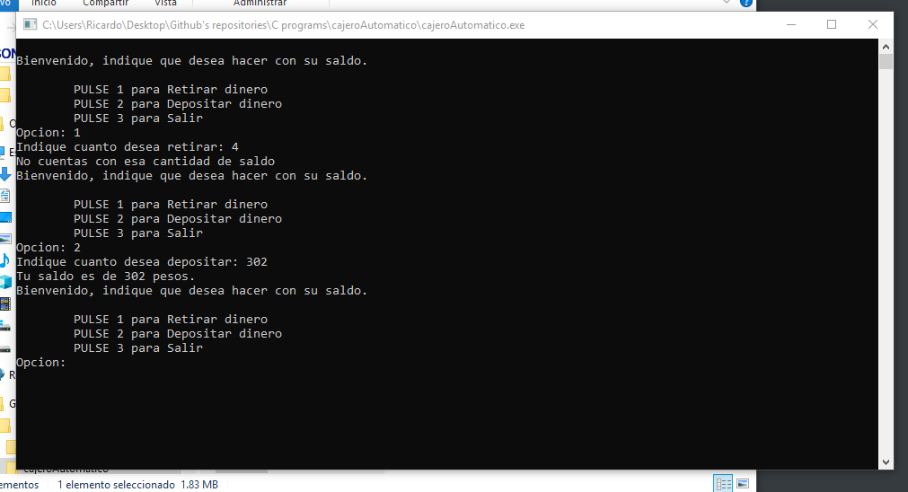

# Simulador de cajero automático.

#### Retiro // Deposito // Menú.

> Este programa simula ser un cajero automático con el cual puedes hacer.
>
> * Retiros 
> * Depositos
> * Cuanta con un menu
> * Validación de los retiros.

#### Ejemplo de uso

#### Compilación.

> Este programa fue compilado usando DEV C++